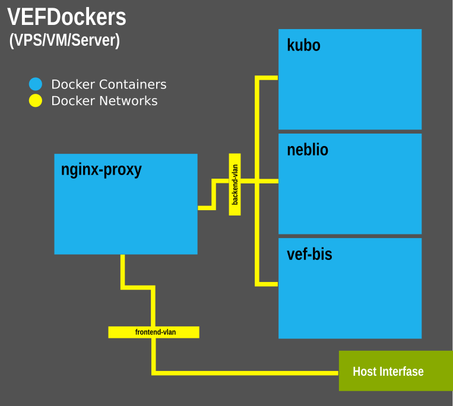

# VEF-BIS-AIO

This project provides an easy way for deployment and maintenance of Virtual Economy Framework services (through Docker containers) using Docker Compose.

Included services/containers:

- vef-bis (The Virtual Economy Framework - Blockchain Indexer Service)
- neblio (A Neblio node running nebliod)
- kubo (An IPFS Implementation written in Go)
- nginx-proxy (Nginx as reverse proxy)

## Diagram of components and connections

<picture>
  <source media="(prefers-color-scheme: dark)" srcset="doc/images/vef-bis-diagram.png">
  <source media="(prefers-color-scheme: light)" srcset="doc/images/vef-bis-diagram.png">
  
</picture>

## Demo Server

This repository also aims to include CI/CD files to deploy these Virtual Economy Framework componets in a community self-hosted Github Action Runner for demostration purposes (see [workflows](.github/workflows) for the CI/CD file.

You can find the demo server hosted by the Virtual Economy Framework Team in this URL [demo.server.url](http://demo.server.url)

[Here](doc/install-github-action-runner.md) are instructions if you want to install a Github Action Runner with Docker and Docker Compose to automate tests and deployments of your implementations of the Virtual Economy Framework on your own servers).

## How to use this?

The following instructions are meant for direct installation in a Linux instance (PC, RPi, VPS/VM, Server) with Docker and Docker Compose installed and without a web server or reverse proxy (like Apache, Nginx and else) between the instance and public internet.

Login (locally or via ssh) to the Linux machine where you want to run the services (remember to have Docker and Docker Compose installed on it), and follow the next steps:

### 1. Get the code

Clone this repository:

    git clone https://github.com/r3c4ll/vef-bis-aio.git

### 2. Set up the config file

TODO

Edit the docker-compose.env file:

    nano docker-compose.env

### 3. Run the services

Run:

    docker-compose --env-file docker-compose.env up

Check the containers running:

    docker compose ps

Check the logs:

    docker-compose logs

## Testing the services

TODO... add diferent CURL commands/options.

## FAQ

#### 1. What is VEF?

...

#### 2. Is this Open Source?

...

#### 3. How I contact the team behind this?

...

More FAQs [here](doc/faqs.md).
